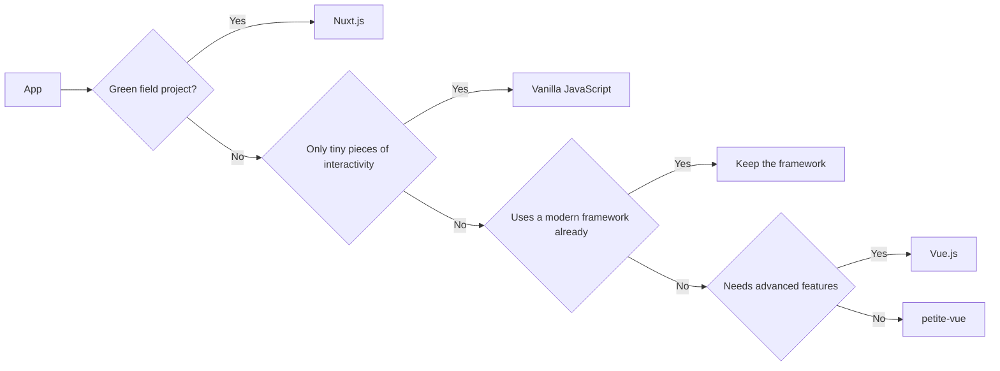

<h1>petite-<span class="text-[#41b883]">vue</span> <logos-vue class="-ml-2 text-2xl" /></h1>

<h2>Progressively enhancing <span class="text-[#41b883]">every</span> application?</h2>

<br><br><br><br>

### Vue.js Amsterdam 2022

<!--

Checklist:

1. Sound (browser - what is love)
2. Slide readability
3. Presenter?
4. Open BACKUP for Live Coding in NEW TAB -> https://codepen.io/manniL/pen/vYdrJRP
5. Open LIVE CODING PEN in SAME TAB as PRESENTATION -> https://codepen.io/manniL/pen/MWQXvGm?editors=1100
6. Open DEMO CodePen BETWEEN LIVE AND PRES -> https://codepen.io/manniL/pen/OJQExxW
7. Set up CodePen editor windows

-->

---
layout: two-cols
heading: About me
---

<template v-slot:default>
<div class="flex flex-col justify-center items-center h-full">

  <h2 class="mt-4">Alexander Lichter</h2>
</div>
</template>

<template v-slot:right>
<VClicks class="space-y-2 mt-10 text-xl h-full">

* <mdi-account-check class="text-green-100" /> Web Development Consultant
* <mdi-microphone /> Speaker & Instructor
* <logos-nuxt-icon /> Nuxt.js Maintainer
* <mdi-twitter class="text-blue-400" /> @TheAlexLichter
* <mdi-web /> [https://lichter.io](https://lichter.io)
* <mdi-github /> [manniL](https://github.com/manniL)

</VClicks>
</template>

---
layout: intro
---

# When we use <logos-vue />...

<VClick>

# ...we often develop SPAs

</VClick>

---
layout: intro
---

# But what percentage of all websites are SPAs?

<!-- 
SPA = Not only Vue

Ask the audience to shout the number
-->

---
layout: intro
---

# Nobody knows!


---

# We don't know how many SPAs exist out there!

<VClick>

* ~15% of all websites use a modern JavaScript framework <span class="ml-2 text-xs">[(Web Almanac 2021)](https://docs.google.com/spreadsheets/d/1zU9rHpI3nC6jTz3xgN6w13afW7x34xAKBh2IPH-lVxk/edit#gid=1851485826)</span>
  * e.g. Vue, Svelte or React

</VClick>

<VClick>

## **But not all these sites are SPAs...**

</VClick>

<!-- 
Dataset: 8.2M websites roughly

Also, there are many non-public facing sites

-->

---

# We <mdi-heart class="text-red-500"/> writing <logos-vue /> applications, right?

<VClicks>

* But we don't always have a green field for our beloved stack
* Often, existing projects are no SPAs
* Maybe they use the LAMP stack or are "traditional server-rendered" Java based monoliths

</VClicks>

<div class="h-10 w-full flex justify-around mt-2 text-4xl" v-click>
  <logos-xampp />
  <logos-java />
</div>

<!--
Ref: The unwanted stack - Maya
-->

---

<div class="flex flex-col items-center justify-center">
<p class="pt-16 text-2xl">

Decisions are often made **against migrating** to an SPA

</p>

<VClicks class="mt-4">

* Not enough time
* Budget too low
* Too much domain knowledge in the code 
* Not enough experience in writing SPAs / in working with the new framework

</VClicks>
</div>

<!--
Or to another framework
-->

---

# But all these applications still need interactivity!

<VClicks>

* Ideally with a modern approach
* And still support devices with no JavaScript as well

</VClicks>


---
layout: intro
---

# Progressive Enhancement


---

# Progressive Enhancement

<VClicks>

* Deliver essential functionalities and content to as many users as possible
* Also to these with disabled/unavailable JavaScript
* Great design philosophy for server-rendered applications (<logos-php /> / <logos-laravel/> / <logos-python/> / <logos-java/> / ...)

</VClicks>

<p v-click class="!mt-32 text-center text-3xl">How to apply Progressive Enhancement?</p>

---

# Idea: Just using <logos-vue /> directly

<VClicks>

* You **can** do that, but...
* Build step setup
* 22.5 kB (but treeshakable)
* Too powerful? (ROLP) 
* Too many things to learn for devs new to JS frameworks?

</VClicks>

---

# Why not using <logos-vue /> directly via CDN then?

<VClicks>

* No build step anymore, but...
* 35.5kB (**+13**) due to runtime template compiler
* No DOM reuse possible 
  * possible when using SSR (<logos-nuxt-icon />)
  * Compiling templates at run-time
  * Throwing away the "existing DOM" that came from the server
* ROLP / too much new too learn apply here too

</VClicks>

---

# How about vanilla <logos-javascript /> then?

<VClicks>

* No extra files to transfer
* Only JS files containing logic
* Feasible for **tiny bits** of interactivity
  * e.g. hamburger menu
* Can be hard to maintain, reuse and not declarative

</VClicks>

---

# How about vanilla <logos-javascript /> then?

<Grid>
<div class="overflow-y-auto h-90">

```js
const form = document.querySelector('#taskform')
const inputElement = document.querySelector('#taskform input')
form.addEventListener('submit', (event) => {
  event.preventDefault()
  const input = inputElement.value
  const isEmpty = !input.length
  if (isEmpty) {
    alert("Please Enter a Task")
    return
  }

  createTask(input)
  initRemoveForDeleteButtons()
  clearInput()
})

function createTask(input) {
  document.querySelector('#tasks').innerHTML += `
    <div class="task">
        <span class="taskname">
            ${input}
        </span>
        <button class="delete">
            Remove
        </button>
    </div>
  `
}

function initRemoveForDeleteButtons() {
  const currentTasks = document.querySelectorAll(".delete")

  Array.from(currentTasks).forEach(task => {
    task.onclick = function () {
      this.parentNode.remove()
    }
  })
}

function clearInput() {
  inputElement.value = ""
}
```

</div>
<Code>

```html
<!DOCTYPE html>
<html>
<head>
  <script src="main.js" defer></script>
</head>

<body>
  <div class="container">
    <h1>Todo List</h1>
    <form id="taskform">
      <input type="text" placeholder="Enter Task">
      <button type="submit">Add</button>
    </form>
    <div id="tasks"></div>
  </div>
</body>
</html>
```

</Code>
</Grid>
---

<div class="text-center relative">

# Okay, one more try - jQuery <mdi-jquery />

</div>

---
clicks: 1
---
<div class="text-center relative">

# Okay, one more try - jQuery <mdi-jquery />


<div v-click="1" class="absolute mx-auto top-25 left-80">

<p>Don't be like Jason!</p>
</div>
</div>

---
layout: intro
---

# But what should we use?


---

# `petite-vue` <logos-vue class="-ml-2 text-xl" />

<VClicks>

* Released on Jul 2, 2021 (roughly a year ago!)
* Created by **Evan You** as a side project
* A minimal subset of Vue (5.5 kB)
* Keeps Vue-like syntax & is powered by `@vue/reactivity`
* Reduced feature scope
* No VDOM
* Can mount to specific areas of the page (as Vue can)

</VClicks>

<!--
Will just walk over the existing dom
-->

---
clicks: 3
---

# From a Vue SFC to the little sister

<Grid>
<Code file="App.vue">

```vue{all|7-12|3}
<script lang="ts" setup>
import { ref } from 'vue'
const count = ref(0)
</script>

<template>
<div>
  Count: {{ count }}
  <button @click="count++">
    Increment
  </button> 
</div>
</template>
```

</Code>
<div>
<Code v-click="1" file="Move the template into the HTML file">

```html
<body>
<div>
  Count: {{ count }}
  <button @click="count++">
    Increment
  </button> 
</div>
</body>
```
</Code>
<Code v-click="2" file="Add v-scope directive">

```html
<body>
<div v-scope="{ count: 0 }">
  Count: {{ count }}
  <button @click="count++">
    Increment
  </button> 
</div>
</body>
```

</Code>
</div>
</Grid>

<Code v-click="3" file="Import petite-vue">

```html
<script src="https://unpkg.com/petite-vue" defer init></script>
```

</Code>

---
clicks: 4
---

# Assembled counter example

<Code file="full-counter-example.html">

```html{all|1|3|3-5|all}
<script src="https://unpkg.com/petite-vue" defer init></script>

<div v-scope="{ count: 0 }">
  Count: {{ count }}
  <button @click="count++">
    Increment
  </button> 
</div>
```

</Code>

<VClicks class="mt-5" at="1">

  * When importing `petite-vue`, we can set the `init` attribute so it will initialize automatically
  * In our template, we declare the state via the `v-scope` directive. It will be accessible for all descendant elements
  * Mustache syntax and event listeners work as usual!

</VClicks>

<!-- 

On init: query all elements that have v-scope directive
Fine grained init also possible
defer -> after HTML is parsed

DEMO in iFrame
-->


---
clicks: 2
---

# Without auto init

<Grid>
<Code>

```html{all|8-13}
<div v-scope="{ count: 0 }">
  Count: {{ count }}
  <button @click="count++">
    Increment
  </button>
</div>

<script src="https://unpkg.com/petite-vue"></script>
<script>
  PetiteVue
    .createApp()
    .mount()
</script>
```

</Code>
<Code v-click>

```html{8-11}
<div v-scope="{ count: 0 }">
  Count: {{ count }}
  <button @click="count++">
    Increment
  </button> 
</div>

<script type="module">
  import { createApp } from 'https://unpkg.com/petite-vue?module'
  createApp().mount()
</script>
```

</Code>
</Grid>

<VClicks class="mt-5" at="1">

  * When not using `init`, we have to call the `createApp` and `mount` manually
  * We can also use the ESM build 🔥

</VClicks>

---
clicks: 3
---

# Mounting to specific elements

<Grid>
<Code v-click="1">

```html{all|7-12,17|2-6} {at: 1}
<div>
  <div>
    <h1>Welcome to my app!</h1>
    <h2>{{ count }} won't render here</h2>
    <h3>Because petite-vue did not mounted here</h3>
  </div>
  <div v-scope="{ count: 0 }" id="counter">
    Count: {{ count }}
    <button @click="count++">
      Increment
    </button> 
  </div>
</div>

<script type="module">
  import { createApp } from 'https://unpkg.com/petite-vue?module'
  createApp().mount('#counter')
</script>
```

</Code>

<VClicks class="mt-5" at="1">

  * Often we only want to make a small part of our app interactive
  * In this case we can mark the element, e.g. via id, and pass the selector to the `mount` call
    * like in Vue.js
  * Other parts of the DOM are not scanned by `petite-vue`

</VClicks>
</Grid>

---
clicks: 4
---

# `createApp` as root scope

<Grid>
<Code v-click="1">

```html{all|12-17|1-8,12-17|5,14-16} {at: 1}
<div v-scope>
  Count: {{ count }}
</div>
<div v-scope>
  <button @click="increment">
    Increment {{ count }} by one
  </button> 
</div>

<script type="module">
  import { createApp } from 'https://unpkg.com/petite-vue?module'
  createApp({
    count: 0,
    increment() {
      this.count++
    }
  }).mount()
</script>
```

</Code>

<VClicks class="mt-5" at="2">

* You can pass state to the `createApp` function
* It will be available in all parts touched by `petite-vue`
* Also, you can pass methods and access data in the Options API style

</VClicks>
</Grid>

---

# Computed properties

<VClicks>

* ...do not exist in `petite-vue`
* Instead you can use a getter function!

</VClicks>

<Code v-click="3">

```html{all|3,12-16} {at: 3}
<div v-scope>
  Count: {{ count }}
  Digit sum {{ digitSum }}
  <button @click="count++">
    Increment
  </button> 
</div>
<script type="module">
  import { createApp } from 'https://unpkg.com/petite-vue?module'
  createApp({
    count: 0,
    get digitSum() {
      return String(this.count)
        .split('')
        .reduce((x, a) => x + Number(a), 0)
    }
  }).mount()
</script>
```

</Code>

---
clicks: 5
---

# Lifecycle hooks in `petite-vue`

<VClicks>

* There are only two hooks when using petite-vue
* `@vue:mounted` and `@vue:unmounted`
* They can be used for each HTML element
* `$el` can be used inline to access the element

</VClicks>

<Code v-click="2">

```html{all|7-8|7-8|all} {at:2}
<div v-scope="{ show: false }">
  <button @click="show = !show">
    Toggle it!
  </button>
  <div
    v-if="show" 
    @vue:unmounted="console.log('unmounted', $el)" 
    @vue:mounted="console.log('mounted', $el)"
  >
    Content is being shown!
  </div>
</div>
```

</Code>

---

# `v-effect`

<VClicks>

* Every app needs **side effects**
* To trigger them based on reactive values we can use `v-effect`

</VClicks>

<VClick>

```html {all|1,11-17|all}
<div v-scope v-effect="getData()">
  <input v-model="input" type="number" min="1" max="10">
  <pre>{{user.name}}</pre>
</div>

<script type="module">
  import { createApp } from 'https://unpkg.com/petite-vue?module'
  createApp({
    input: '',
    user: {},
    async getData () {
      if(!this.input) {
        return
      }
      const url = 'https://jsonplaceholder.typicode.com/users/' + this.input
      this.user = await fetch(url).then(r => r.json())
    }
  }).mount()
</script>
```

</VClick>

---

# Components in `petite-vue` I

<VClicks>

* `petite-vue` provides a way to abstract components too
* Components are functions returning the components state, getters and methods

</VClicks>

<Grid>
<div v-click>

```html
<script type="module">
  import { createApp } from 'https://unpkg.com/petite-vue?module'
  
  function NumberList(props) {
    return {
      numbers: props.numbers,
      get min() {
        return Math.min(...this.numbers)
      },
      addNumber() {
        this.numbers.push(this.numbers.length)
      }
    }
  }
  
  createApp({ NumberList }).mount()
</script>
```

</div>

<div v-click>

```html
<div v-scope="NumberList({ numbers: [1, 2, 3] })">
  <p>{{ numbers }}</p>
  <p>Min: {{ min }}</p>
  <button @click="addNumber">Add Number</button>
</div>

<div v-scope="NumberList({ numbers: [0] })">
  <p>{{ numbers }}</p>
  <p>Min: {{ min }}</p>
  <button @click="addNumber">Add Number</button>
</div>
```

</div>
</Grid>

---

# Components in `petite-vue` II

<VClicks>

* But what about component `template`s?
* `<template>` to the rescue!

</VClicks>

<Grid>
<div v-click>

```html
<div v-scope="NumberList({ numbers: [1, 2, 3] })">
  <p>{{ numbers }}</p>
  <p>Min: {{ min }}</p>
  <button @click="addNumber">Add Number</button>
</div>

<div v-scope="NumberList({ numbers: [0] })">
  <p>{{ numbers }}</p>
  <p>Min: {{ min }}</p>
  <button @click="addNumber">Add Number</button>
</div>
```

</div>

<div v-click>

```html
<div v-scope="NumberList({ numbers: [1, 2, 3] })">
<div v-scope="NumberList({ numbers: [0] })">

<template id="number-list-template">
  <p>{{ numbers }}</p>
  <p>Min: {{ min }}</p>
  <button @click="addNumber">Add Number</button>
</template>

<script type="module">
  /* ... */
  function NumberList(props) {
    return {
      $template: '#number-list-template',
      /* ... */
    }
  }
  
  createApp({ NumberList }).mount()
</script>
```

</div>
</Grid>

---

# Limitations of `petite-vue`

<VClicks>

* No `render` functions (due to missing VDOM)
* Teleports, Suspense and other SPA features
* Transitions (can be theoretically added as a plugin though)
* No `ref`, no `computed`
* No CSP-safe build (there is a [fork](https://github.com/baptistejamin/petite-vue-csp) for that though)

</VClicks>

<!--

* As `petite-vue` is a subset, some features of Vue are not available
* Most of them are not needed for progressive enhancement anyway, e.g.:

-->

---

# Alpine.js

<Grid>
<Code file="petite-vue.html">

```html
<div v-scope="{ count: 0 }">
  <button @click="count++">Increment</button> 
  <span>{{ count }}</span>
</div>
```

</Code>
<Code v-click file="alpine.html">

```html
<div x-data="{ count: 0 }">
  <button x-on:click="count++">Increment</button>
  <span x-text="count"></span>
</div>
```

</Code>
</Grid>


---

# Alpine.js and `petite-vue`

<VClicks>

* Alpine.js is a lightweight JavaScript framework as well
* It was inspired by Vue and uses `@vue/reactivity` under the hood
* `petite-vue` on the other hand was inspired by **Alpine**

</VClicks>


---

# Differences between Alpine and `petite-vue`

<VClicks>

* Alpine is 2x larger than `petite-vue` and comes with a few more features (like a transition system)
* It also steers towards its own ecosystem
* `petite-vue` was thougth as even more minimal compared to Alpine, but also "vue compatible" 
* Comes in handy for potentional later migration to Vue.js if desired

</VClicks>

---

# My decision tree
When building applications

<div v-click class="-mt-24 h-80">



</div>

---
layout: intro
---
# [Live Coding](https://codepen.io/manniL/pen/MWQXvGm?editors=1010)

---

# Conclusion

<VClicks>

* Not all projects are SPAs and some don't **have to**!
* Use the appropriate tools in your toolbelt
* `petite-vue` + progressive enhancement = **perfect match**
* Part of the **Vue ecosystem**
* Easy migration to "full Vue"

</VClicks>

<VClick>

<div class="text-6xl mt-16 flex justify-center">
<mdi-heart class="text-red-500" />
<logos-vue />
</div>

</VClick>

---
layout: two-cols
heading: Thanks for your attention
---

<template v-slot:default>
<div class="flex flex-col justify-center items-center h-full">

  <h2 class="mt-4">Alexander Lichter</h2>
</div>
</template>

<template v-slot:right>
<div class="space-y-2 mt-10 text-xl h-full">

* <mdi-account-check class="text-green-100" /> Web Development Consultant
* <mdi-microphone /> Speaker & Instructor
* <logos-nuxt-icon /> Nuxt.js Maintainer
* <mdi-twitter class="text-blue-400" /> @TheAlexLichter
* <mdi-web /> [https://lichter.io](https://lichter.io)
* <mdi-github /> [manniL](https://github.com/manniL)

</div>
</template>

---
layout: intro
---

# Thanks a lot to my sponsors!


