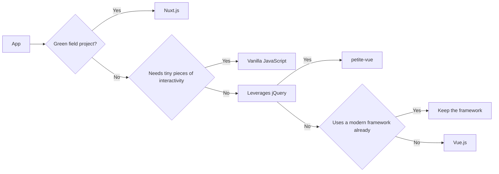

---
layout: intro
---

<h1>petite-<span class="text-[#41b883]">vue</span> <logos-vue class="-ml-2 text-2xl" /></h1>

<h2>Progressively enhancing <span class="text-[#41b883]">every</span> application?</h2>

<br><br><br><br>

### Vue.js Amsterdam 2022

---
layout: two-cols
heading: About me
---

<template v-slot:default>
<div class="flex flex-col justify-center items-center h-full">

  <h2 class="mt-4">Alexander Lichter</h2>
</div>
</template>

<template v-slot:right>
<VClicks class="space-y-2 mt-10 text-xl h-full">

* <mdi-account-check class="text-green-100" /> Web Development Consultant
* <mdi-microphone /> Speaker & Instructor
* <logos-nuxt-icon /> Nuxt.js Maintainer
* <mdi-twitter class="text-blue-400" /> @TheAlexLichter
* <mdi-web /> [https://lichter.io](https://lichter.io)

</VClicks>
</template>

---
layout: intro
---

# When we use <logos-vue />...
# ...we often develop SPAs

---
layout: intro
---

# But what percentage of all websites are SPAs?

<!-- 
SPA = Not only Vue

Ask the audience to shout the number
-->

---

# We don't know how many SPAs exist out there!

<VClicks>

* ~15% of all websites use a modern JavaScript framework <span class="ml-2 text-xs">[(Web Almanac 2021)](https://docs.google.com/spreadsheets/d/1zU9rHpI3nC6jTz3xgN6w13afW7x34xAKBh2IPH-lVxk/edit#gid=1851485826)</span>
  * e.g. Vue, Svelte or React
* But not all these sites are SPAs...

</VClicks>

<!-- 
Dataset: 8.2M websites roughly

Also, there are many non-public facing sites

-->

---

# We <mdi-heart class="text-red-500"/> writing <logos-vue /> applications, right?

<VClicks>

* But we don't always a green field 
* Often, existing projects are no SPAs
* Maybe they use the LAMP stack or are "traditional server-rendered" Java based monoliths

</VClicks>


<div class="h-10 w-full flex justify-around mt-2 text-4xl" v-click>

<logos-xampp />
<logos-java />

</div>

<VClicks class="mt-8">

* Often, decisions are **against migrating** a large project to an SPA or even another framework
* Not enough time
* Budget too low
* Too much domain knowledge in the code 
* Not enough experience in writing SPAs / in working with the new framework

</VClicks>

---

# But all these applications still need interactivity!

<VClicks>

* Ideally with a modern approach
* And still support devices with no JavaScript as well

</VClicks>


---
layout: intro
---

# Progressive Enhancement


---

# Progressive Enhancement

<VClicks>

* Deliver essential functionalities and content to as many users as possible
* Especially those that don't have JavaScript enabled or available!
* Great design philosophy for server-rendered applications (<logos-php /> / <logos-laravel/> / <logos-python/> / <logos-java/> / ...)

</VClicks>

<p v-click class="!mt-32 text-center text-3xl">How to apply Progressive Enhancement?</p>

---

# Idea: Just using <logos-vue /> directly

<VClicks>

* You **can** do that, but...
* You have to set up your toolchain and configure the build step
* It has a size of 22.5 kB (but is treeshakable)
* It might be too powerful (ROLP) 
* Or even too much new things to learn for devs new to JavaScript frameworks

</VClicks>

---

# Why not using <logos-vue /> directly via CDN then?

<VClicks>

* No build step anymore, but...
* 13 kB additional overhead due to the runtime template compiler
* No DOM reuse possible (e.g. when using SSR + <logos-nuxt-icon />)
* Compiling templates at run-time and throwing away the "existing DOM" that came from the server.
* ROLP / too much new too learn apply here too

</VClicks>

---

# How about vanilla <logos-javascript /> then?

<VClicks>

* No extra files to transfer besides the JS files containing logic
* Totally feasible for **tiny bits** of interactivity
* e.g. a hamburger menu
* But hard to maintain, reuse and not declarative

</VClicks>

---

# How about vanilla <logos-javascript /> then?

<Grid>
<div class="overflow-y-auto h-90">

```js
const form = document.querySelector('#taskform')
const inputElement = document.querySelector('#taskform input')
form.addEventListener('submit', (event) => {
  event.preventDefault()
  const input = inputElement.value
  const isEmpty = !input.length
  if (isEmpty) {
    alert("Please Enter a Task")
    return
  }

  createTask(input)
  initRemoveForDeleteButtons()
  clearInput()
})

function createTask(input) {
  document.querySelector('#tasks').innerHTML += `
    <div class="task">
        <span class="taskname">
            ${input}
        </span>
        <button class="delete">
            Remove
        </button>
    </div>
  `
}

function initRemoveForDeleteButtons() {
  const currentTasks = document.querySelectorAll(".delete")

  Array.from(currentTasks).forEach(task => {
    task.onclick = function () {
      this.parentNode.remove()
    }
  })
}

function clearInput() {
  inputElement.value = ""
}
```

</div>
<Code>

```html
<!DOCTYPE html>
<html>
<head>
  <script src="main.js" defer></script>
</head>

<body>
  <div class="container">
    <h1>Todo List</h1>
    <form id="taskform">
      <input type="text" placeholder="Enter Task">
      <button type="submit">Add</button>
    </form>
    <div id="tasks"></div>
  </div>
</body>
</html>
```

</Code>
</Grid>
---

<div class="text-center">

# Okay, one more try - jQuery <mdi-jquery />

<VClick>

</VClick>
</div>

---
layout: intro
---

# But what should we use?


---

# `petite-vue` <logos-vue class="-ml-2 text-xl" />

<VClicks>

* Released on Jul 2, 2021 (roughly a year ago!)
* A minimal subset of Vue (5.5 kB)
* Keeps Vue-like syntax & is powered by `@vue/reactivity`
* Reduced feature scope
* No VDOM
* Can mount to specific areas of the page (as Vue can)

</VClicks>

---

# From a Vue SFC to the little sister

<Grid>
<Code file="App.vue">

```vue
<script lang="ts" setup>
import { ref } from 'vue'
const count = ref(0)
</script>

<template>
<div>
  Count: {{ count }}
  <button @click="count++">
    Increment
  </button> 
</div>
</template>
```

</Code>
<div>
<Code v-click file="Move the template into the HTML file">

```html
<body>
<div>
  Count: {{ count }}
  <button @click="count++">
    Increment
  </button> 
</div>
</body>
```
</Code>
<Code v-click file="Add v-scope directive">

```html
<body>
<div v-scope="{ count: 0 }">
  Count: {{ count }}
  <button @click="count++">
    Increment
  </button> 
</div>
</body>
```

</Code>
</div>
</Grid>

<Code v-click file="Import petite-vue">

```html
<script src="https://unpkg.com/petite-vue" defer init></script>
```

</Code>

---
clicks: 4
---

# Assembled counter example

<Code file="full-counter-example.html">

```html{all|1|3|3-5|all}
<script src="https://unpkg.com/petite-vue" defer init></script>

<div v-scope="{ count: 0 }">
  Count: {{ count }}
  <button @click="count++">
    Increment
  </button> 
</div>
```

</Code>

<VClicks class="mt-5" at="1">

  * When importing `petite-vue`, we can set the `init` attribute so it will initialize automatically
  * In our template, we declare the state via the `v-scope` directive. It will be accessible for all descendant elements
  * Mustache syntax and event listeners work as usual!

</VClicks>

<!-- 

On init: query all elements that have v-scope directive
Fine grained init also possible
defer -> after HTML is parsed

-->

---
clicks: 2
---

# Without auto init

<Grid>
<Code>

```html{all|1,11-13}
<script src="https://unpkg.com/petite-vue" defer></script>

<div v-scope="{ count: 0 }">
  Count: {{ count }}
  <button @click="count++">
    Increment
  </button> 
</div>

<script>
  PetiteVue
    .createApp()
    .mount()
</script>
```

</Code>
<Code v-click>

```html{8-11}
<div v-scope="{ count: 0 }">
  Count: {{ count }}
  <button @click="count++">
    Increment
  </button> 
</div>

<script type="module">
  import { createApp } from 'https://unpkg.com/petite-vue?module'
  createApp().mount()
</script>
```

</Code>
</Grid>

<VClicks class="mt-5" at="1">

  * When not using `init`, we have to call the `createApp` and `mount` manually
  * We can also use the ESM build 🔥

</VClicks>

---

# Mounting to specific elements

---

# `createApp` as root state

---

# No computeds

---

# Lifecycle hooks in `petite-vue`

---

# `v-effect`

---

# Components in `petite-vue`

---

# Your own Store

```html
<script>
  import { createApp, reactive } from 'https://unpkg.com/petite-vue?module'
  
  const store = reactive({
    count: 0,
    increment () {
      this.count++
    }
  })
  
  createApp({ store }).mount()
</script>
```

---

# Limitations of `petite-vue`

<VClicks>

* As `petite-vue` is a subset, some features of Vue are not available
* Most of them are not needed for progressive enhancement anyway, e.g.:
* No `render` functions (due to missing VDOM)
* Teleports, Suspense and other SPA features
* Transitions (can be theoretically added as a plugin though)
* No `ref`, no `computed`
* No CSP-safe build (there is a [fork](https://github.com/baptistejamin/petite-vue-csp) for that though)

</VClicks>

---

# Alpine.js and `petite-vue`

<VClicks>

* Alpine.js is a lightweight JavaScript framework as well
* It was inspired by Vue and uses `@vue/reactivity` under the hood
* `petite-vue` on the other hand was inspired by **Alpine**
* Full circle! 

</VClicks>


---

# Showcasing Alpine & `petite-vue`

<Grid>
<Code file="alpine.html">

```html
<div x-data="{ count: 0 }">
  <button x-on:click="count++">Increment</button>
  <span x-text="count"></span>
</div>
```

</Code>
<Code file="petite-vue.html">

```html
<div v-scope="{ count: 0 }">
  <button @click="count++">Increment</button> 
  <span>{{ count }}</span>
</div>
```

</Code>
</Grid>


---

# Differences between Alpine and `petite-vue`

<VClicks>

* Alpine is 2x larger than `petite-vue` and comes with a few more features (like a transition system)
* It also steers towards its own ecosystem
* `petite-vue` was thougth as even more minimal compared to Alpine, but also "vue compatible" 
* Comes in handy for potentional later migration to Vue.js if desired

</VClicks>

---

# My decision tree
When building applications

<div v-click class="-mt-24 h-80">



</div>

---

# Conclusion

<VClicks>

* Not all projects are SPAs and some don't **have to**!
* Use the appropriate tools in your belt for the task
* `petite-vue` is a nice option to sprinkle interactivity into your server-rendered application
* It is smaller and has no VDOM -> ideal for progressive enhancement
* Vuesers will have an easy time writing `petite-vue` and it will make a possible migration easier

</VClicks>

<VClick>

<div class="text-6xl mt-16 flex justify-center">
<mdi-heart class="text-red-500" />
<logos-vue />
</div>

</VClick>

---
layout: two-cols
heading: Thanks for your attention
---

<template v-slot:default>
<div class="flex flex-col justify-center items-center h-full">

  <h2 class="mt-4">Alexander Lichter</h2>
</div>
</template>

<template v-slot:right>
<div class="space-y-2 mt-10 text-xl h-full">

* <mdi-account-check class="text-green-100" /> Web Development Consultant
* <mdi-microphone /> Speaker & Instructor
* <logos-nuxt-icon /> Nuxt.js Maintainer
* <mdi-twitter class="text-blue-400" /> @TheAlexLichter
* <mdi-web /> [https://lichter.io](https://lichter.io)

</div>
</template>

---
layout: intro
---

# Thanks a lot to my sponsors!


